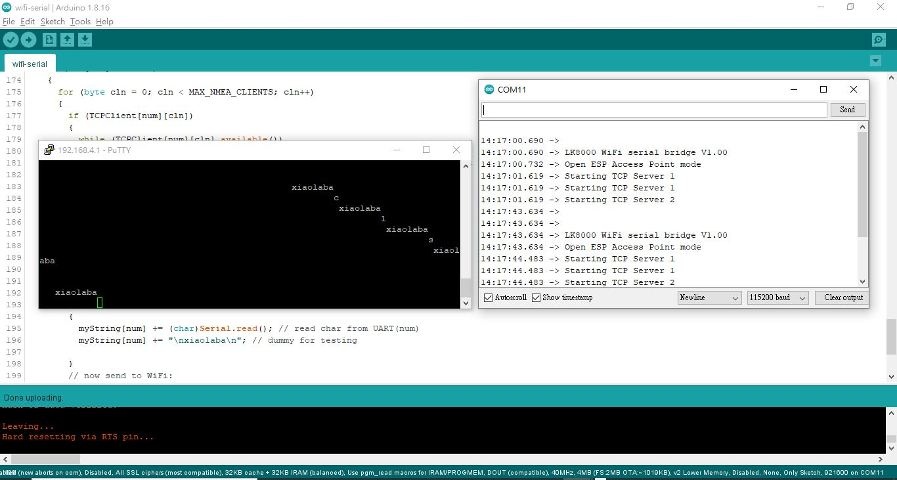

# ESP8266_WIFI_UART
clone https://atadiat.com/en/e-esp8266-esp32-wifi-serial-bridge-converter/  
Serial Bridge Using ESP8266 (Simpler)  

### tweak a little bit to source code
debug baud rate changed to 115200  
dummy testing string "n\xiaolaba\n"  

### testing
open putty  
host 192.168.4.1  
port 8880  
connection type : RAW  
  
open arduino IDE serial port monitor  
type something and send

### test result
  

### firmware and burn
burn.bat  
note : if not to use arduino IDE to burn firnware, close serial port monitor first before uses this BAT file to burn the firmware, otherwise port access failure and no code to be burned.  
```
:: by xiaolaba, 2022-JAN-20  

set COM_PORT=COM11  
set BAUD_RATE=921600  
set FIRMWARE=wifi-serial.ino.bin  

%USERPROFILE%\AppData\Local\Arduino15\packages\esp8266\tools\python3\3.7.2-post1/python3 ^  
-I %USERPROFILE%\AppData\Local\Arduino15\packages\esp8266\hardware\esp8266\3.0.2/tools/upload.py ^  
--chip esp8266 ^  
--port %COM_PORT% ^  
--baud %BAUD_RATE% ^  
--before default_reset ^  
--after hard_reset write_flash 0x0 %FIRMWARE%  


pause  
```


